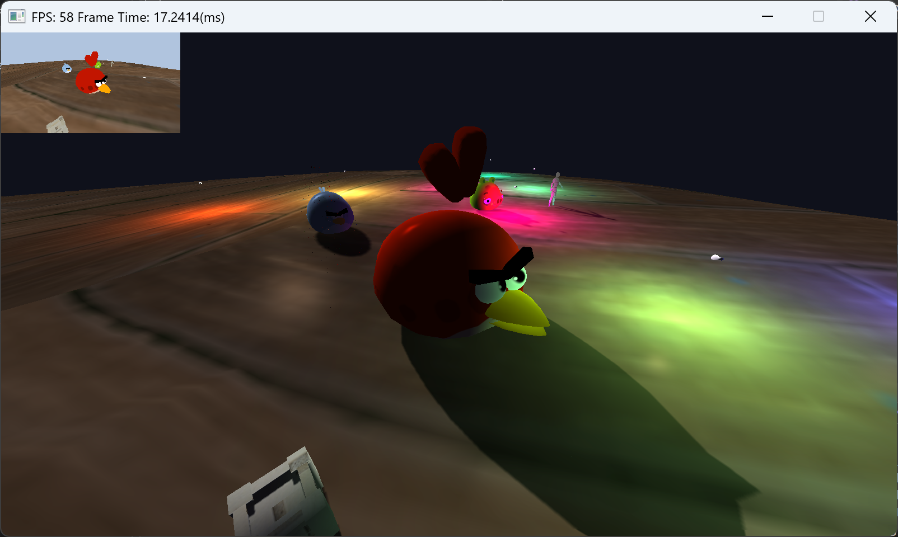
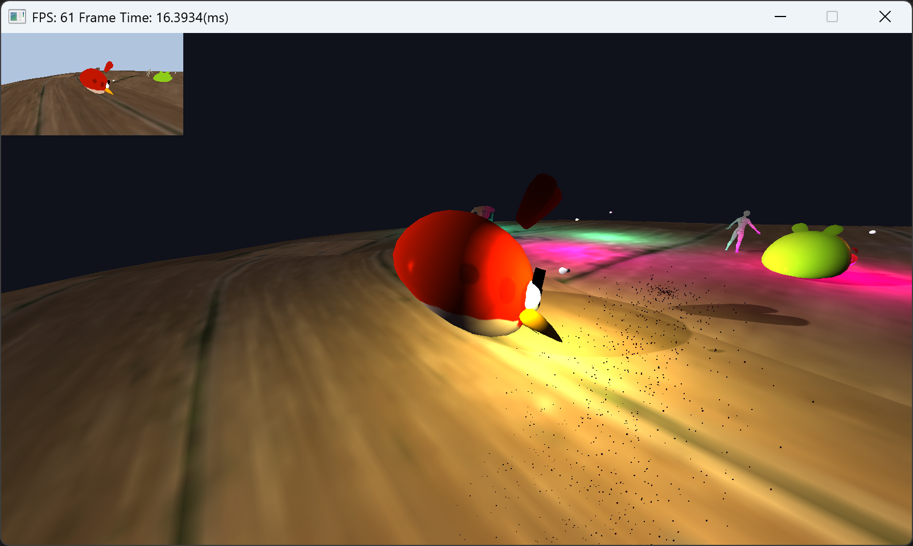
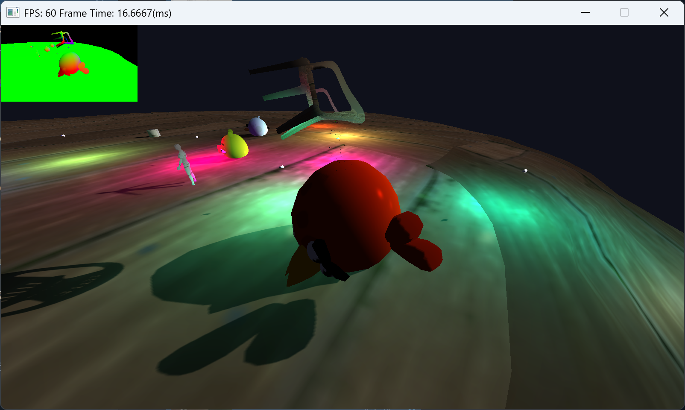

# Scald Render Engine

## Screenshots

 

 

 

## Features
### Graphics

- Deferred Rendering
  - GBuffer (Color, Normal, WorldPos)
- Lighting & Shadows
  - Directional Lights (Cascaded Shadows)
  - Point Lights
  - PCF Shadows
- Simple Particles

## Building ScaldEngine
ScaldEngine uses the [CMake](https://cmake.org) configuration system.

### Visual Studio
Generate project files by running `generate_project_files.bat`.
If you are working with Visual Studio 2022, you can setup a Visual Studio solution by running `build_debug.bat`.
The solution files are written to `build/` and the binary output is located in `build/bin`.